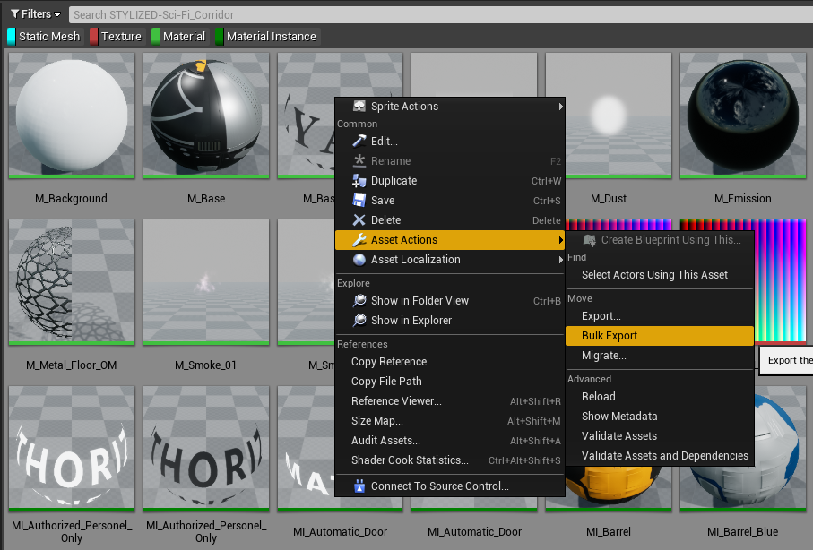
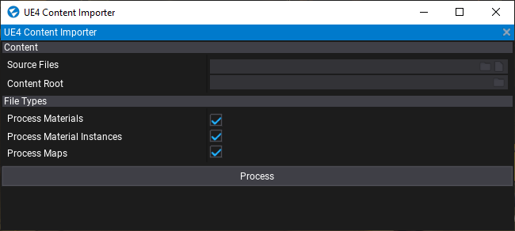
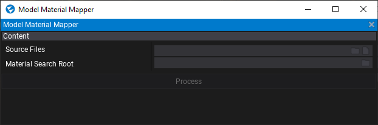

# UE4 Converter for Flax Engine

This plugin provides utilities for converting assets from UE4 to assets that can be consumed by Flax
Engine.

Currently supported assets:
- Materials
- Material Instances
- Maps

## Experimental Warning

This plugin is experimental and may cause data loss. There are also stability issues where the editor
may crash during the conversion process.

It is **highly** recommended that you install this plugin to a separate project and prepare your
assets there before moving them to your actual project.

## Installation

1. Create a `Plugins` directory in your project then use your preferred method of cloning repositories to a folder called `UE4ContentImporter`.
2. Add `Modules.Add("UE4ContentImporterEditor");` to your editor target file.
3. You should now find a new menu entry under `Tools` containing the utilities provided by the plugin.

## Instructions

## Using the Content Importer

### Preparation

First you must prepare the assets from UE4.

Start by selecting all textures, materials, material instances and model files from within the Unreal
editor. To make this process easier you can use asset filters in the content window to find assets
across all sub-directories. Once you've selected them, right click then find *Bulk Export* under *Asset
actions*. Export them to an intermediate directory of your choosing.

**Important:**
- Do not export assets directly to your Flax project.
- FBX files should be exported without collisions. If you do you will get double hulls.

If you intend to convert maps then you must export them individually, there is currently no bulk export
method in Unreal that allows you to export in anything other than FBX format. You should export as `Unreal object text (*.T3D)`. 

### Using the Content Importer

You will find the Content Importer under `Tools` ⟶ `UE4 Utilities` ⟶ `Content Importer`. The window looks like this:

| Name        | Description |
| ----------- | ----------- |
| Source Files               | Select a single T3D file or an entire directory. Sub-directories will also be processed. |
| Content Root               | This should be the root of the exported content (the directory above `Game` in the exported directory hierarchy. This is used to find referenced assets such as textures. |
| Process Materials          | Should materials be imported? |
| Process Material Instances | Should material instances be imported? |
| Process Maps               | Should maps be imported? |

### Using the Model Material Mapper

When you import models the material references will be broken. You can use this utility to attempt to fix these missing references.

| Name        | Description |
| ----------- | ----------- |
| Source Files         | Select a single Flax model file or an entire directory. Sub-directories will also be processed. |
| Material Search Root | The directory within your `Content` project to search for materials. Sub-directories will also be searched. |

*Note:* The utility will get confused when there are multiple materials with the same name. It will pick the first material it finds.

## Known Issues

- Decal rotation is incorrect in many cases.
- Intensities have different scales in UE4 and Flax and need to be manually adjusted in your materials. Scaling by 10 is a good place to start. 

## I found a bug

Cool, open an issue or even better open a PR with a fix.

## FAQ

### The Flax Engine log contains entries referring to missing properties, converters and processors.

The plugin does not support converting everything that comes out of UE4. Flax Engine also does not
support everything that UE4 does so cannot be converted.

In many cases the features reported in the entries do not affect the final output but where they do you
can open an issue with an example and we'll consider adding support. PR's are also welcome.

### My material is empty

The plugin is still unstable and sometimes Flax Engine doesn't create the material properly.

Try the following resolutions:
1. Check for exceptions as these will abort the conversion process, if the exception is within the plugin
then log an issue or open a PR with a fix.
2. Run the importer again. This will fix most problems.
3. Restart the editor. Sometimes the fresh assets don't appear in Flax Engine.

Stability and reliability is an issue that is actively being worked on.

### My map lighting doesn't match UE4

Lighting presents a problem when moving between engines. There's not much that can be done here and it is
expected that you will need to manually tweak lighting values to what makes sense for the scene in Flax
Engine.

If there are improvements you think can be made then issues and PR's are welcome.

### My map is all foggy

In most cases this is because volumetric fog has been enabled. You can disable this on any fog volumes in the scene. This is a bug and will be fixed.

### My map is black

Did you rebuild lighting? If yes it's probably a bug so log an issue or submit a PR.
